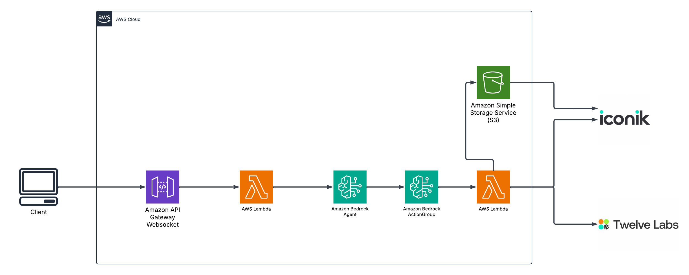

# GenAI Sport Highlighter with TwelveLabs

A powerful integration between TwelveLabs and Iconik that leverages AI to enhance video asset management and search capabilities. This application provides an intuitive chat interface for advanced video search, analysis, and highlight generation.

## Features

- Advanced Search Processing: Complex search queries supporting exact phrases, metadata queries, date/numeric ranges, fuzzy matching, and nested fields
- Video Analysis: Automated video indexing and analysis using TwelveLabs AI
- Highlight Generation: Automatic generation of video highlights based on content analysis
- Real-time Chat Interface: Modern, responsive chat interface for natural language interactions
- Metadata Management: Seamless synchronization of metadata between TwelveLabs and Iconik
- API Logging: Comprehensive logging system for debugging and monitoring

## Tech Stack

- Frontend: React with TypeScript, Material-UI
- Backend: Node.js with TypeScript
- Infrastructure: AWS (SST Framework)
- AI/ML: TwelveLabs API
- Asset Management: Iconik API
- Development Tools: ESLint, Prettier

## Architecture Diagram



## Prerequisites

- Node.js (v16 or higher)
- npm or yarn
- AWS CLI configured with appropriate credentials
- TwelveLabs API Key
- Iconik API credentials

## Environment Variables

Create a `.env` file with the following variables:

```
TWELVELABS_API_KEY=your_api_key
TWELVELABS_HIGHLIGHTS_INDEX_ID=your_index_id
ICONIK_APP_ID=your_app_id
ICONIK_API_KEY=your_api_key
ICONIK_METADATA_MATCH_VIEW=your_view_id
ICONIK_COLLECTION_ID=your_collection_id
SHORTIO_API_KEY=your_api_key
SHORTIO_DOMAIN=your_domain
```

## Getting Started

1. Clone the repository:
```bash
git clone https://github.com/yourusername/genai-twelvelabs-iconik.git
cd genai-twelvelabs-iconik
```

2. Install dependencies:
```bash
npm install
```

3. Start the development environment:
```bash
# Start frontend in development mode
npm run dev:frontend

# Start backend in development mode
npm run dev:backend
```

## Deployment

To deploy the application to AWS:
- Configure the `sst.config.ts` file with your desired settings and add the FFMPeg layer ARN.
- Run the following command:

```bash
  npx sst deploy --stage STAGE_NAME
```


## Project Structure

```
├── packages/
│   ├── frontend/          # React frontend application
│   │   ├── src/
│   │   ├── package.json
│   │   └── tsconfig.json
│   └── backend/           # Node.js backend application
│       ├── src/
│       ├── package.json
│       └── tsconfig.json
├── sst.config.ts         # SST infrastructure configuration
├── package.json
└── README.md
```

## Search Query Examples

Basic Search:
```
"National School"              # Exact phrase search
metadata.first_name:Barack     # Metadata field search
```

Advanced Search:
```
metadata.first_name:Barack !metadata.last_name:Obama title:"National School"
metadata.startdate:[2018-06-05 TO 2018-06-12]
```

## Contributing

1. Fork the repository
2. Create your feature branch (`git checkout -b feature/AmazingFeature`)
3. Commit your changes (`git commit -m 'Add some AmazingFeature'`)
4. Push to the branch (`git push origin feature/AmazingFeature`)
5. Open a Pull Request

## License

Distributed under the MIT License. See `LICENSE` for more information.

## Acknowledgments

- TwelveLabs for their powerful video analysis API
- Iconik for their comprehensive asset management platform
- The SST framework team for their excellent infrastructure tools
